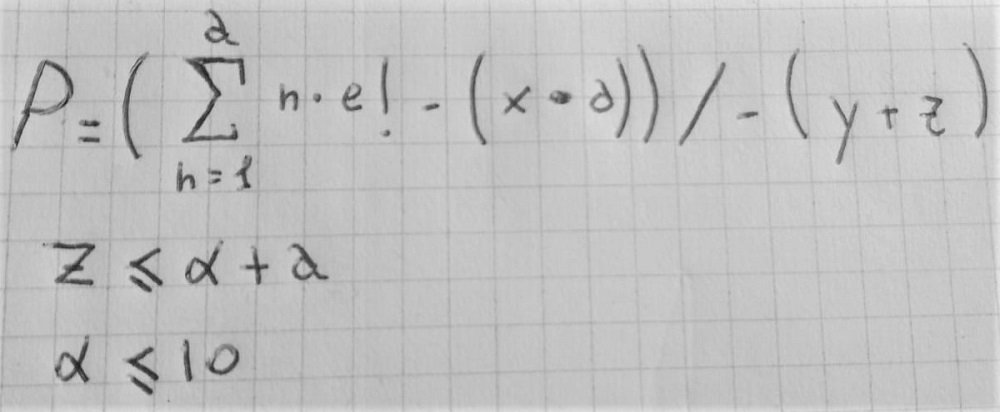

# Formula_predizione_ingressi_ai_siti_web

## Descrizione
Questa formula e stata formulata per predire i futuri ingressi nei siti web.  
E stata formulata da Andrei Anghi nel 21/03/2023.

## Cosa richiede?
Questa formula richiede:
* Media delle entrate
* Media dei visitatori
* Numero di valori messi in media

## Formula e spiegazione

